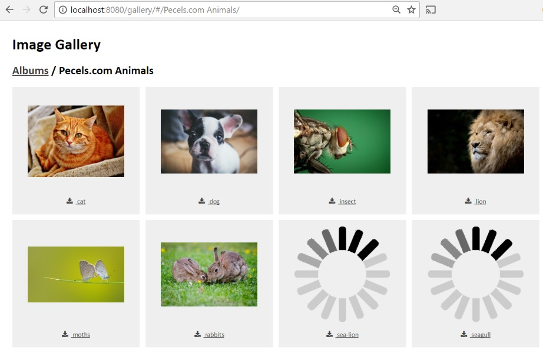
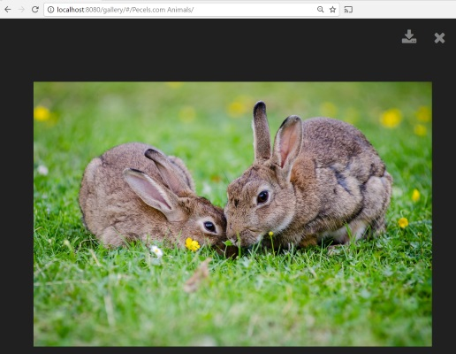
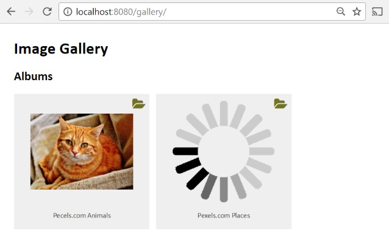

# Simple Image File Gallery

## Overview

This is a rudimentary utility to display thumbnails of images stored in an album directory. Mostly, I wanted an easy eay to browse through image files on a website without having to mess with databases, frameworks, etc.

"Features" include:

* No database required ("copy to deploy")
* Automatic thumbnail generation, including handling of nested subdirectories
* AJAX enabled gallery pages come up quickly, and with thumbnails appearing once they are generated
* Clean segretation of back-end services and front-end rendering (easy skinning)
* Navigation supporting hash-tag URLs (for folder-specific linking)
* Minimal framework usage in client, none in services (should be easy to integrate into something else)
* Platform independence (Docker used for development and optionally for deployment, Python for helper scripts)

## Requirements

### Runtime

* PHP 5.6, 7.0 or greater
* PHP Imagick extension

### Development Environment

If you want to develop webservices or run the Simple Image File Gallery in a container locally, you'll need:

* Python 2.7 or greater
* Docker (Linux, Mac or Windows)

## Installation

### Runtime

Copy all files in the "gallery* directory to a directory on your website. Store any images you want to view in the gallery/albums directory.  You can browse to that directory, and you should see thumbnails of your files once they are generated

## Operation

Currently, there is only one viewer ("basic") which uses template files to render the current document locaiton 

When you access the album, the basic viewer client calls the webservice "info" which scans the album directory and renders a tile for each directory and file located therein.

When a file is accessed, the "thumbnails" folder is checked to see if there is a corresponding thumbnail (base file name, followed by "-thumbnail.jpg").  If the thumbnail exists, it is renderd.  If the thumbnail does not exist, a placeholder "spinner" is displayed and a separate webservice call is made to generate the thumbnail. Once the thumbnail is generated, it will be displayed.



Clicking on a thumbnail will display a "full-screen" preview of the image.  You can download the full file by clicking on the file name in the tile or in the download icon in the full-screen view.



Similarly, when a folder is accessed, the "thumbnails" folder is checked to see if there is a thumbnail called "directory.jpg".  If the thumbnail exists, it is rendered.  If the thumbnail does not exist, then then like a new file, a placeholder "spinner" is displayed and a separate webservice call is made to generate the thumbnail.  In the case of a directory, its contents are checked to see if a thumbnail is available or can be generated.  Once the thumbnail is generated, it will be displayed.  Clicking anywhere on a folder tile will display the folder.



## Configuration and Customization

### Services

By default, image files are accessed in the "gallery/albums" directory,and accesss by the "albums" URL segment.  Thumbnails are maximum 200 pixels wide and high, with aspect ratio preserved.

You can configure the services by editing the ``` gallery/webservice/config.json ``` file.  You'll need to edit this if you want to store albums in a different directory, or have a virtual directory you want to use to access that directory that is not named "albums".  You can also set the thumbnail size in this file.

* imageUrl: the URL segment used to access images relative to the page used to display the gallery
* imagePath:  the directory used to retrieve images from the file system relative to the "webservice" directory
* thumbnailMaxWidth: the maximum width of generated thumbnails
* thumbnailMaxHeight: the maximum height of generated thumbnails

### Client

The client viewer is rendered via the "/gallery/index.html", which basically just loads JQuery, Mustache and Font Awesome, the external dependencies for the default (and currently only) basic viewer, and then the base viewer itself.

The basic viewer has four templates used to render an album. 

* template_panel.html - renders the breadcrumb header and the panel that displays items (folders and thumbnails)
* template_folder.html - renders a folder tile
* template_file.html - renders a file tile and links to the full page viewer
* template_viewer - renders the full page viewer

All of the styles can be tweaked in basic/css/style.css

## Troubleshooting

If stuff doesn't work...

* If you don't get "anything" make sure you have PHP on your server and that your files are deployed where you think they are deployed
* If you see a title but no images, make sure that your images are in the "albums" directory (or, if in a different location, that you have properly configured webservice/config.json)
* In your browser, hit F12 and check the response from the "info" call.  PHP may be inserting warnings or errors that are pre-empting the data being returned
* If you do not get thumbnails, make sure you have the Imagick PHP on your server (set up a phpinfo page to check)

## Development

### Project Organization

* Root folder - contains Docker definition, Python helper (run.py) and index.php (phpinfo)
* gallery folder - contains albums folder (image file), viewers folder (rendering), webservice (webservice, duh) and index.html (thin wrapper for rendering)
* docimages - where the images you see in this document are stored
* logs - where container logs are stored for Apache, apt-get, etc.

### Development Container

A Dockerfile is included to build a container that will run the gallery (renderer and webservice).  It can optionally be built with PHPUnit, XDEBUG and NPM.  It's based on the PHP 7 base image, but also can be switched to PHP 5.6 (check the commented FROM at the top of Dokerfile.gallery).

### Getting started

### Development environment

You'll need Python and Docker.  By default, the container uses port 8080.  Once the container is running, if you browse to http://localhost:8080 you should get a phpinfo page.  If you browse to http://localhost:8080/gallery, you should be viewing your album (if you have copied images in gallery/albums, you should get thumbnails). 


To get the development environment up and going, you will need to do the following:

* ```run.py build``` - this builds the Docker container and includes XDEBUG and other development tools
* ```run.py install-basic-viewer``` - run this once to install and organize the client support libraries like JQuery that the gallery needs to run
* ```run.py start``` - launches the container, at this point, you should be able to run "http://localhost:8080/gallery" and see a blank page (you can copy image and image folders in the "gallery/albums" folder)
* ```run.py shell``` - if stuff goes wrong and you need to troubleshoot, this command will open a shell in to the running container
* ```run.py webservice-test``` - this runs the PHPUnit unit tests for the webservice code and displays the results in the web browser
* ```run.py stop``` - this stops the container

### Webservice Overview

There are two supported webservice calls, "/info/_directory-or-file_" and "/thumbnail/_directory-or-file_".  The _directory-or-file_ parameter is a relative directory or file name with the "gallery/albums" directory.  Calls like ```/info/Hawaii%20Trip/beach_1.jpg``` are okay (nested directories are supported).

#### /info Webesrvice Call

This accepts an optional parameter for a specific directory or file (if not provided the contents of gallery/albums are assumed).

The payload for a directory includes:

* name - the name to display (directory name), unless the directory contains a file called "directory.txt", and its contents will override what is shown in this property
* type - "directory" for dirctories
* parent - if this directory is a child directory of "gallery/albums", this will contain the parent directory
* dataUrl - the webservice URL to call to get information about the directory
* modified - timestamp for when the directory was created or last modified
* thumbnailUrl - the thumbnail for the directory, which is generated based upon the first child folder or file contained in the directory
* children - a list of directories and files contained in the directory

Note that "children" is only included for the requested directory, it will not be included for the parent or children directories

The payload for a file includes:

* name - the name to display (file name without the extension)
* filename - the name of the file (including extension)
* type - "file" for files
* imageUrl - the relative URL to the location of the image file
* thumbnailUrl - the relative URL to the lcoation of the thumbnail image (if available)
* modified - timestamp for when the file was created or last modified

#### index.php (Entry Point)

This loads the configuration and creates instances Router and AlbumProcessor clasess.  It then passes the command provided in the query string variable ```?cmd``` (which gets populated by .htaccess) to the router.

### Router Class

This class forwards "/info" and "/thumbnail" requests to the AlbumProcessor, returning back status 200 and data for successful calls, and status 400 for errors (exception messages get populated in the return payload's ErrorMessage property).  All other calls return 404 (not found).

### Configuration Classs

Loads the configuration, parses, and provides an accessor for individual configuraiton items.

### AlbumProcessor Class

This is the workhorse that is responsible for parsing directories, creating thumbnails, and returning their contents.  If you are going to change existing functionality in the webservice, this is probably where you will do it.  Care has been taken to keep this class cross-platform and to work with symlinks.  Unit test coverage is currently 100% (you can do ``run.py webservice-test``` to run webservice tests).

### Client Rendering

The provided client rederer uses a relatively minimal set of libraries (by today's standards) - JQuery (mostly for Ajax handling) and Mustache (for template substitution).  In ```index.html``` the Javsscript libraries are loaded, and a div with the ID of "gallery" is where the gallery will show up.  If you want to create a viewer using AngularJS, React, etc., refer to Webservices documentation above for information about the "/info" and "/thumbnail" webservice calls.